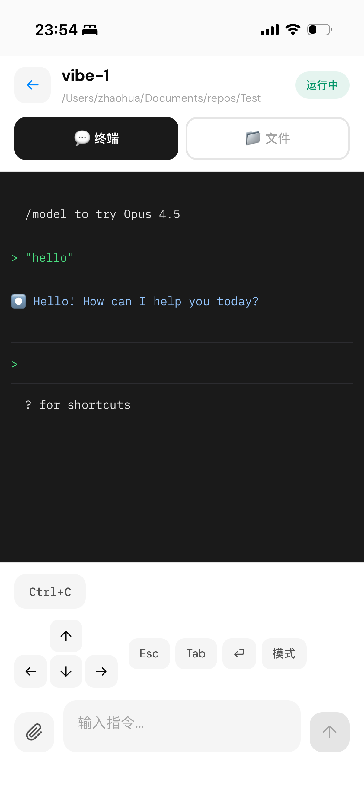
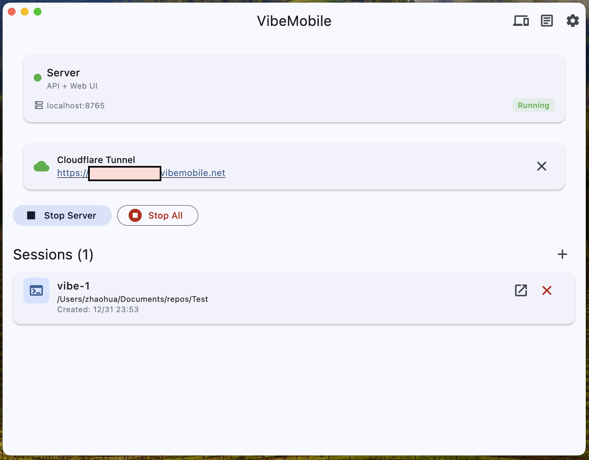
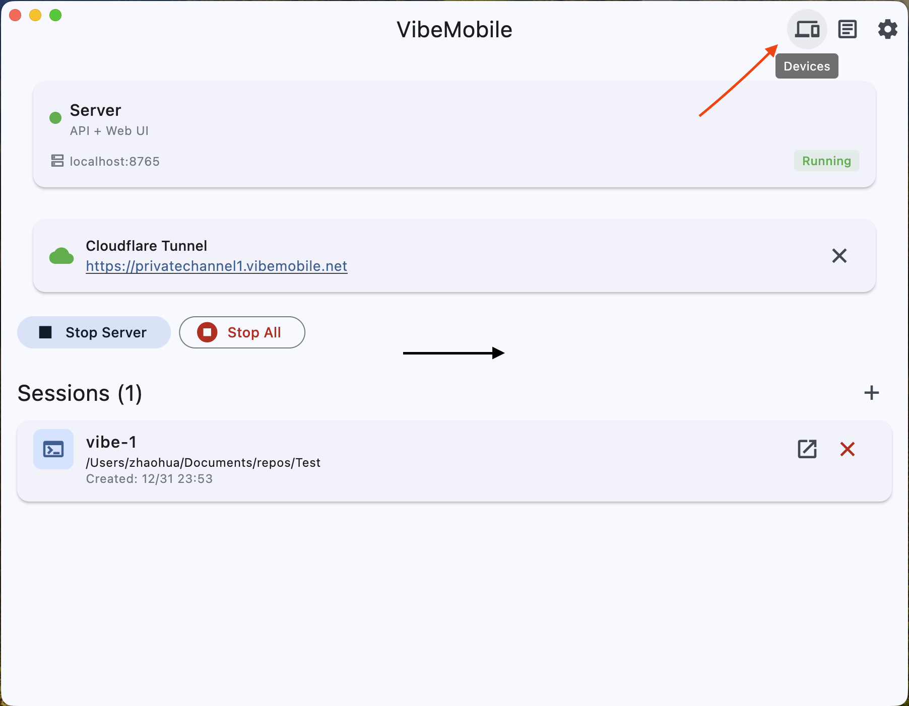
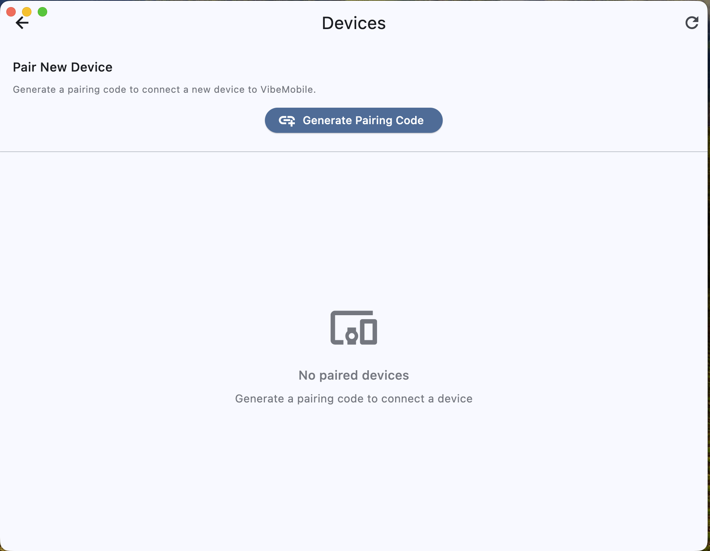
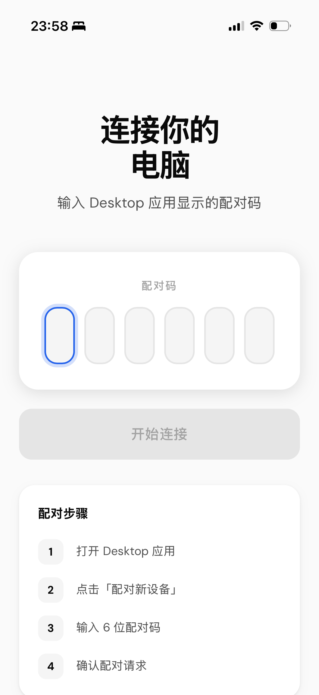
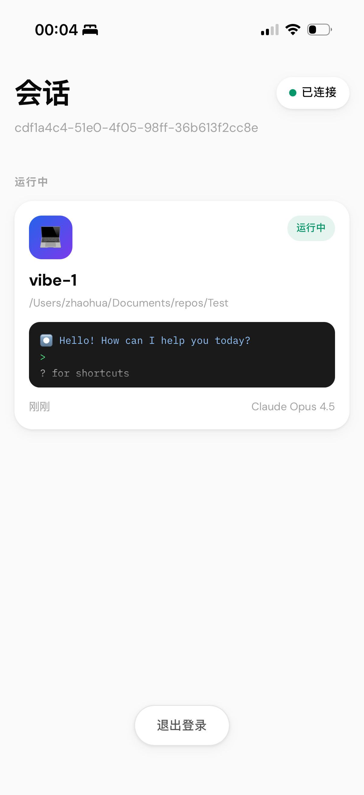
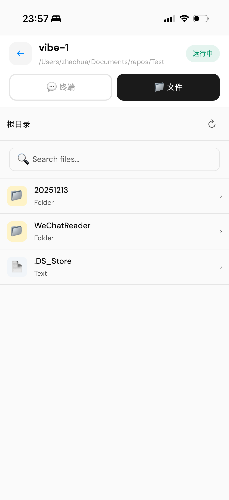

# VibeMobile

Remote control for Claude Code and GitHub Copilot CLI sessions from your phone. **macOS desktop host, mobile browser client**.

<p align="center">
  
</p>

## Install

```bash
curl -fsSL https://raw.githubusercontent.com/fafa-npu/VibeMobile/main/install.sh | bash
```

This installs dependencies and the app. After installation, restart Terminal or run `source ~/.zshrc`.

## Usage

### 1. Start the App

In Terminal, run:
```bash
vibemobile
```

### 2. Start Server & Create Session

Click **"Start Server"**, then click **"+"** to create a new Claude Code or GitHub Copilot CLI session.

<p align="center">
  
</p>

### 3. Connect from Phone

- **Same network**: Open `http://YOUR_MAC_IP:8765` in your phone browser
- **Remote access**: Click **"Start Tunnel"** and copy the generated Microsoft Dev Tunnel URL


### 4. Pair Your Device

1. In the desktop app, click **Devices** icon → **"Generate Pairing Code"**
2. On your phone, enter the 6-digit code
3. Approve the pairing request in the desktop app
<p align="center">
  
</p>

<p align="center">
  
</p>
<p align="center">
  
  </p>

### 5. Control AI CLI Sessions

Once paired, you can:
- View sessions and real-time output
- Send messages to Claude Code or GitHub Copilot CLI
- Browse project files
- Upload images

<p align="center">
  
  
  
</p>

## Remote Access Providers

VibeMobile can expose the local server through a tunnel provider so your phone can connect without router or firewall setup.

- **Microsoft Dev Tunnel (default)**: install `devtunnel`, sign in once with `devtunnel user login`, then start the tunnel from VibeMobile.
- **Cloudflare Tunnel**: still supported for existing users and custom-domain setups; install it with `brew install cloudflare/cloudflare/cloudflared` if needed.

## Custom Domain (Optional)

The built-in quick tunnel generates a random URL each time. For a permanent domain:

1. Set up a [Cloudflare Tunnel](https://developers.cloudflare.com/cloudflare-one/connections/connect-networks/) with your own domain
2. Point the tunnel to `http://localhost:8765`
3. Access VibeMobile from your custom domain anywhere

## Manual Install

Download `VibeMobile.dmg` from [Releases](https://github.com/fafa-npu/VibeMobile/releases):

1. Open DMG and drag VibeMobile to Applications
2. Double-click to run (app is signed and notarized by Apple)

**Requirements**: macOS 12+, Node.js 18+, tmux, GitHub CLI + Copilot extension, devtunnel (`brew install node tmux gh microsoft/dev-tunnels/devtunnel && gh extension install github/gh-copilot`)

## Troubleshooting

| Issue | Fix |
|-------|-----|
| App won't open | `open /Applications/VibeMobile.app` |
| Server won't start | Check Node.js: `node --version` |
| No sessions | Check tmux: `tmux ls` |

## License

MIT - see [LICENSE](LICENSE)
